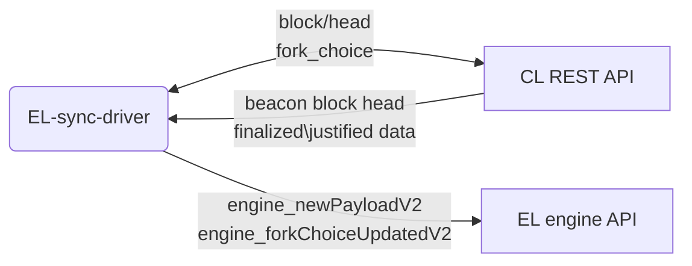

# EL Sync Driver

This tool is able to drive multiple execution layers to sync emulating a CL client.

The tool only requires to access an existing Consensus Client rest API.



## Installation

Clone the repository and install the dependencies:

```bash
git clone https://github.com/tbenr/el-sync-driver.git
cd el-sync-driver
npm install
```
## Configuration

Specify a Consensus Layer rest API endpoint and the list of Execution Layers engine api endpoint and secret file

```json
{
    "ClRestApiEndpoint": "http://localhost:5051",
    "ElJsonrpcEndpoints": [
        {
            "endpoint": "http://localhost:8551",
            "jwtSecretFile": "/path/to/secret"
        }
    ]
}
```

## Usage
Start by running:

```bash
npm start
```

### output while driving

