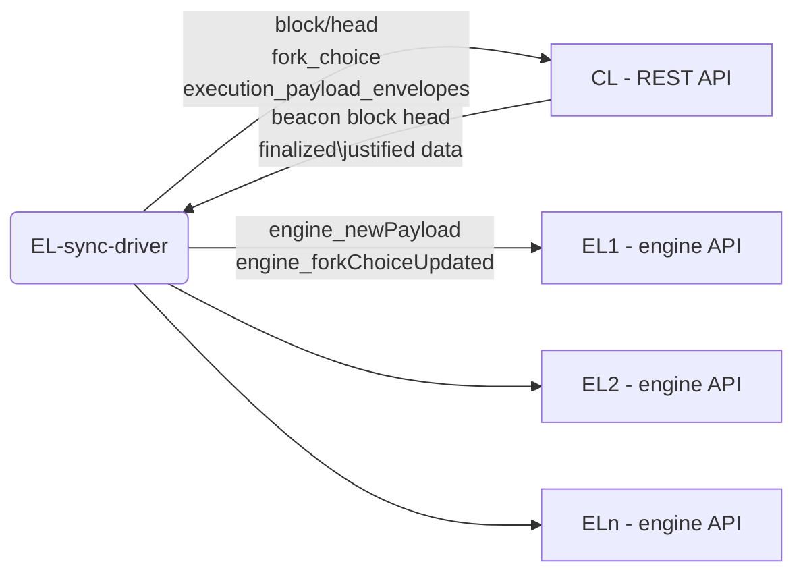

# EL Sync Driver

This tool is able to drive multiple Execution Layer Clients sync process. It emulates a Consensus Layer Client for each EL by using an existing CL as source of truth.

The tool is designed to minimize the changes on the existing CL client. It only requires to consume standard BeaconNode rest API, thus no changes in CL configuration are required (not even client restart) as long as rest APIs are already enabled.


```mermaid
graph LR
    B(EL-sync-driver) -- block/head<br />fork_choice<br />execution_payload_envelopes --> C[CL - REST API]
    C -- beacon block head<br />finalized\justified data--> B
    B -- engine_newPayload<br />engine_forkChoiceUpdated --> D[EL1 - engine API]
    B --> E[EL2 - engine API]
    B --> F[ELn - engine API]
```

## Supported forks

| Fork | Engine API calls |
|---|---|
| capella | `engine_newPayloadV2`, `engine_forkchoiceUpdatedV2` |
| deneb | `engine_newPayloadV3`, `engine_forkchoiceUpdatedV3` |
| electra | `engine_newPayloadV4`, `engine_forkchoiceUpdatedV3` |
| fulu | `engine_newPayloadV4`, `engine_forkchoiceUpdatedV3` |
| gloas | `engine_newPayloadV5`, `engine_forkchoiceUpdatedV4` |

On gloas (ePBS) the execution payload is not part of the beacon block: it is fetched from
`/eth/v1/beacon/execution_payload_envelopes/{block_root}`. If the head payload has not been
revealed yet, the driver falls back to the parent block's payload for that round.

## Requirements

Node.js 20 or newer. There are no runtime dependencies.

## Installation

```bash
git clone https://github.com/tbenr/el-sync-driver.git
cd el-sync-driver
```

## Configuration

Edit `config.json` and specify a Consensus Layer rest API endpoint and the list of Execution Layers engine api endpoint and secret file

```json
{
    "ClRestApiEndpoint": "http://localhost:5051",
    "ElJsonrpcEndpoints": [
        {
            "endpoint": "http://localhost:8551",
            "jwtSecretFile": "/path/to/secret"
        }
    ]
}
```

Environment variables:

| Variable | Default | Meaning |
|---|---|---|
| `CONFIG` | `config.json` | path of the configuration file |
| `LOG_LEVEL` | `info` | `debug`, `info`, `warn` or `error`. `debug` logs full engine API params and results |

If you want to use docker, edit `docker-compose.yml` to mount secret file(s) in the container.

## Usage
Start by running:

```bash
npm start
```

or by using docker-compose:

```bash
docker-compose up
```

### Output while driving

One line per new head, with the `newPayload` (NP) and `forkchoiceUpdated` (FCU) status returned by each EL:

```
2026-09-11T15:40:12.001Z INFO  [driver] slot 1234 (fulu) block #1201 0x8f1c2a…9e01 | 127.0.0.1:8551: NP=SYNCING(38ms) FCU=SYNCING(4ms) | 127.0.0.1:8561: NP=VALID(21ms) FCU=VALID(3ms)
```

## Testing

Unit tests use the built-in Node test runner:

```bash
npm test
```

End-to-end runs against real clients use [Kurtosis](https://docs.kurtosis.com/) and
[ethereum-package](https://github.com/ethpandaops/ethereum-package). The script starts a
two-participant devnet, stops participant 2's CL so that its EL lags behind, and writes a
config pointing the driver at participant 1's CL and participant 2's EL:

```bash
kurtosis/run.sh fulu          # or: kurtosis/run.sh gloas
LOG_LEVEL=debug CONFIG=kurtosis/config.fulu.json npm start
kurtosis/run.sh fulu status   # compare head vs. the driven EL block number
kurtosis/run.sh fulu down
```

## Disclaimer

This is an experimental tool and is provided as-is, without any kind of warranty or support. Use it at your own risk. The author and contributors of this project are not responsible for any damages or losses that may occur from the use of this tool. It is recommended to thoroughly review and test the code before using it in any production environment.

## Usage Notice

Please note that this tool is intended for educational and experimental purposes only. It is not recommended to use this tool in any critical or production systems. The tool may have limitations, known issues, or security vulnerabilities that have not been thoroughly tested or addressed.

## Contributing

Contributions to this project are welcome, but please understand that there may be no active maintenance or support for this tool. If you encounter any issues or have suggestions, you can submit them as GitHub issues, but there is no guarantee that they will be addressed or resolved.

## License

This project is licensed under the MIT License. See the [LICENSE](LICENSE) file for details.
